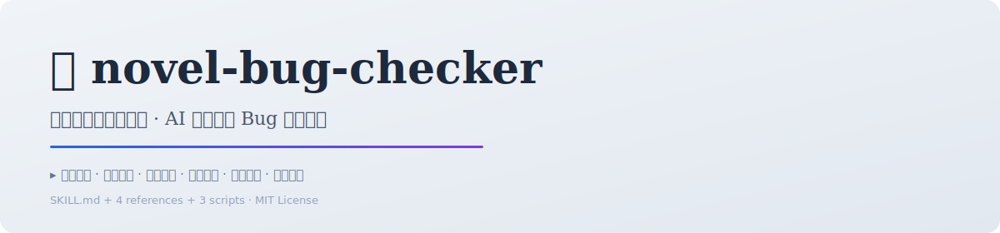

# 🔍 novel-bug-checker

> **出版级中文小说 · 叙事质量审计官**
>
> 专业级中文小说叙事质量检测工具，定位逻辑漏洞、角色不一致、节奏问题与叙事 Bug，输出分级报告与可落地修复建议。
> **v2 增强：可直接消费 novel-master 的分布式状态（NCG + 角色子进程），做更高精度的 OOC / 设定崩坏反向校验。**
>
> 📦 **v2.0.0 完整源码已发布在 GitHub：**[`bbroot/novel-bug-checker`](https://github.com/bbroot/novel-bug-checker)。ClawHub 市场页为 v1 入口，v2 内容请从 GitHub 获取与安装。

<p align="center">
  <picture>
    <source media="(prefers-color-scheme: dark)" srcset="assets/banner-dark.svg">
    
  </picture>
</p>

<p align="center">
  <a href="#english">English</a> · <a href="#中文">中文</a>
</p>

<p align="center">
  <a href="https://clawhub.ai/bbroot/skills/novel-bug-checker"></a>
  <a href="https://github.com/bbroot/novel-bug-checker"></a>
  <a href="LICENSE"></a>  <a href="#-小说创作三件套"></a>

  <a href="#v2-增强联动-novel-master"></a>
</p>

---

<h2 id="中文">🌟 为什么选择 novel-bug-checker？</h2>

| 维度 | 手动检查 | **novel-bug-checker v2** |
|------|---------|-------------------------|
| 🎯 检测范围 | 依赖个人经验，容易遗漏 | **系统化扫描**：逻辑/角色/节奏/伏笔 全维度 |
| 🧠 反向校验 | 只看正文，缺乏事实源 | **消费 NCG + 角色子进程**：对照作者自己的设定图谱查 |
| 📊 报告体系 | 口头反馈，难以量化 | **分级报告**：🔴致命 / 🟠严重 / 🟡中等 / 🟢轻微 |
| 🔧 修复方案 | 需要自行思考 | **策略库驱动**：每个 Bug 至少 3 种修复方案 |
| 👥 OOC 检测 | 凭感觉 | **对照认知偏差包**：角色说出了不属于自己的话即报警 |
| 🔄 可验证 | 无法复检 | **修复验证**：修改后自动重检，对比前后报告 |

---

## ✨ 核心特性

### 🔗 v2 增强：联动 novel-master 分布式状态（原创联动）

当被检查作品由 **novel-master v2** 创作（存在 `tracker/ncg.json` 与 `settings/characters/*/state.json`）时，可直接消费这些产物做定向排查：

- **👤 OOC 检测** — 拿正文的角色言行对照其 `state.json` 的认知偏差包与关系网，发现「说出了不属于自己的话 / 与关系矛盾的行为」→ 直接定位行。
- **🗺️ 地理/时间穿越** — 对照 NCG 节点的位置与章号，标出无过渡的位移（与审计门禁互补，二次把关）。
- **🧵 伏笔断裂** — 对照 `ncg.json` 的伏笔/因果节点与 `foreshadowing.json`，找出「埋了没收」或「收得不在窗口」。
- **🔒 版本回退告警** — 调用 `auditor.py check-version`，把角色状态版本异常列入 🔴 致命级。

> 若作品并非 v2 架构（无 ncg.json），自动回落到 v1 三脚本分析，完全兼容。

### 🕵️ 逻辑漏洞检测（v1）

- **时间线矛盾**：事件顺序、时间计算、因果时序
- **因果断裂**：关键转折缺少前置条件、结果无原因支撑
- **能力突变**：未设定的能力突然出现、力量体系不一致
- **信息知晓不合理**：角色知道不应该知道的信息

### 👤 角色一致性检查（v1）

- **性格突变 / 动机矛盾**：无动机的行为变化、目标与行动不一致
- **对话风格偏移**：语言特征与角色背景不符
- **成长弧线断裂**：角色发展缺少必要经历支撑

### 📈 节奏结构分析（v1）

- **信息密度 / 高潮铺垫 / 场景过渡 / 伏笔管理**：分布评估与缺口识别

### 🔄 修复验证

提供修改版本后自动重检，对比前后报告，标注已修复与新增问题。

---

## 📖 如何使用

### 安装

```bash
# OpenClaw 用户
openclaw skills install novel-bug-checker

# 或通过 ClawHub CLI
clawhub install novel-bug-checker
```

### 依赖

```bash
pip install jieba
```

> 仅依赖 `jieba`（中文分词），轻量无需重型 NLP 库。

### 开始检查

告诉 AI：**「帮我检查这段小说的逻辑漏洞」** 或直接粘贴小说章节内容。

AI 将自动执行：读取文本 → 逻辑分析 → 角色一致性检查 → 节奏分析 → 生成分级报告。

### v2 联动排查（针对 novel-master 作品）

```bash
# 版本一致性 + 因果伏笔流（需 novel-master 脚本存在）
python ~/.qclaw/skills/novel-master/scripts/auditor.py check-version <书名>
python ~/.qclaw/skills/novel-master/scripts/ncg.py view <书名> causal
```

### 命令行模式（v1，可选）

```bash
python scripts/logic-analyzer.py novel.txt -o report.txt
python scripts/rhythm-analyzer.py novel.txt -g 玄幻
python scripts/consistency-checker.py novel.txt -o report.txt
```

---

## 🏗️ 项目结构

```
novel-bug-checker/
├── SKILL.md                          # 技能主文件
├── README.md                         # 本文件（中文）
├── assets/                           # Banner 资源
├── references/                       # 参考资料
│   ├── bug-patterns.md               # 常见 Bug 模式分类
│   ├── character-consistency.md      # 角色一致性检查指南
│   ├── narrative-theory.md           # 叙事学理论基础
│   └── repair-strategies.md          # 修复策略库
├── scripts/                          # 分析脚本
│   ├── logic-analyzer.py             # 逻辑漏洞分析
│   ├── rhythm-analyzer.py            # 节奏分析
│   └── consistency-checker.py        # 角色一致性检查
├── templates/                        # 输出模板
└── example.md                        # 使用示例
```

---

## 🎯 适用场景

- ✅ **长篇网络小说**：玄幻/都市/悬疑 — 大型架构全面审查
- ✅ **群像小说**：配合 novel-master v2 做 OOC / 设定崩坏反向校验
- ✅ **出版级文学小说**：达到专业标准
- ✅ **连载作品**：章节发布前质控
- ✅ **完本修订**：出版前通盘排查
- ✅ **写作教学**：案例驱动的叙事问题分析与修复

---

## 🤝 贡献

Issues 和 PR 欢迎提交！本项目遵循 [MIT 许可证](LICENSE)，可自由使用、修改和分发。

---

## 📦 技术栈

- **运行环境**：OpenClaw AI Agent + Python 3
- **核心依赖**：jieba（中文分词）
- **格式**：Markdown + Python + TXT
- **许可证**：MIT

---

<p align="center">
  本 skill 是 novels 生产线 **「审」** 的把关：接在 novel-master 之后查漏，story-to-video-master 改编前先过本关。

---

## 🔗 小说创作三件套（与另两个 skill 联动）

本 skill 是 **「小说创作三件套」** 的一环，三个 skill 构成完整的小说生产 → 质检 → 视觉化流水线：

| 环节 | Skill | 职责 |
|------|-------|------|
| ✍️ 创作 | **[novel-master](https://github.com/bbroot/novel-master)** | 出版级小说创作（灵感 → 终稿），输出 v2 结构化产物 |
| 🔍 审计 | **[novel-bug-checker](https://github.com/bbroot/novel-bug-checker)** | 叙事质量审计官，出书前消灭逻辑 / 角色 Bug |
| 🎬 视觉化 | **[story-to-video-master](https://github.com/bbroot/story-to-video-master)** | 把成稿改编为分镜与视频（角色锁定冻结闸门） |

> 推荐工作流：`novel-master 写书 → novel-bug-checker 审计 → story-to-video-master 改编`。
> 三者均通过 OpenClaw Skill 软链安装，story-to-video-master 可直接消费前两者的产物（伏笔台账 / 冲突记录 / NCG / 文风日志），无需重新分析。

Made with ❤️ by <a href="https://github.com/bbroot">bbroot</a><br>
  <sub>为每一部认真写作的小说的质量护航</sub>
</p>
